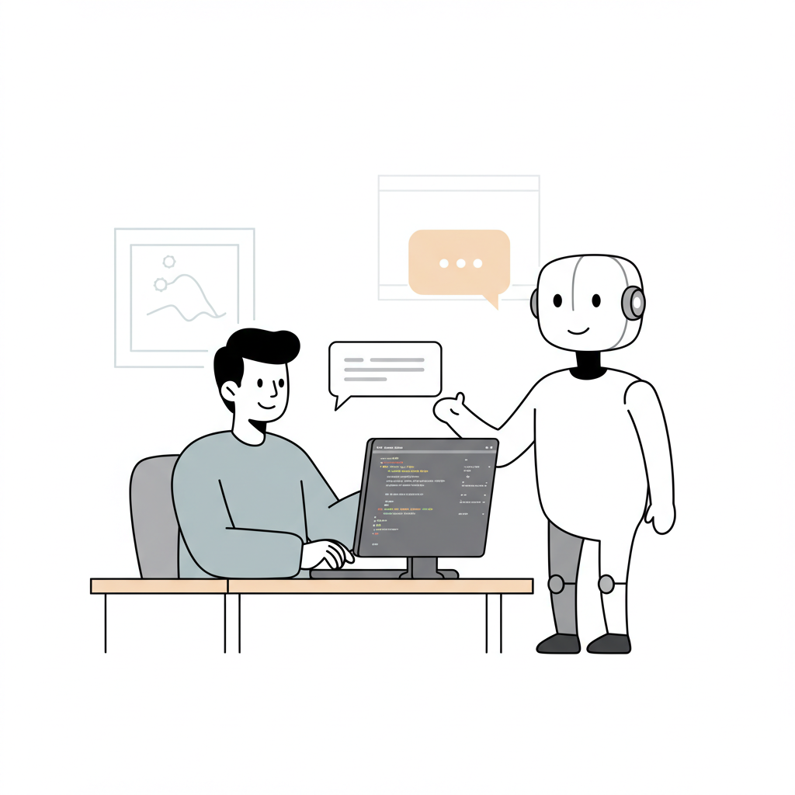

# Practical guide for AI Agents use and Best Practices  

## Introduction

This document outlines a comprehensive set of best practices for designing, developing, deploying, and maintaining code with AI agents across various applications and domains.  

## Purpose

A step by step instructions and convention to maintain code with AI agents. These documents serve as a guide for developers to follow when using AI agents, ensuring that they adhere to best practices and standards.
 
## Practical Implementation Stages

| Stage | Description |
|-------|-------------|
| [1. Idea Honing](01-idea-honing.md) | Refining and clarifying the initial concept |
| [2. Codebase Analysis and Documentation](02-codebase-analysis.md) | Understanding and documenting existing code |
| [3. Building Small Tasks](03-build-small-tasks%20copy.md) | Breaking down implementation into manageable tasks |
| [4. Task Execution](04-task-execution%20copy.md) | Executing and monitoring individual tasks |
| [5. Advanced Setup](05-advanced-setup.md) | Advanced configuration and setup |

