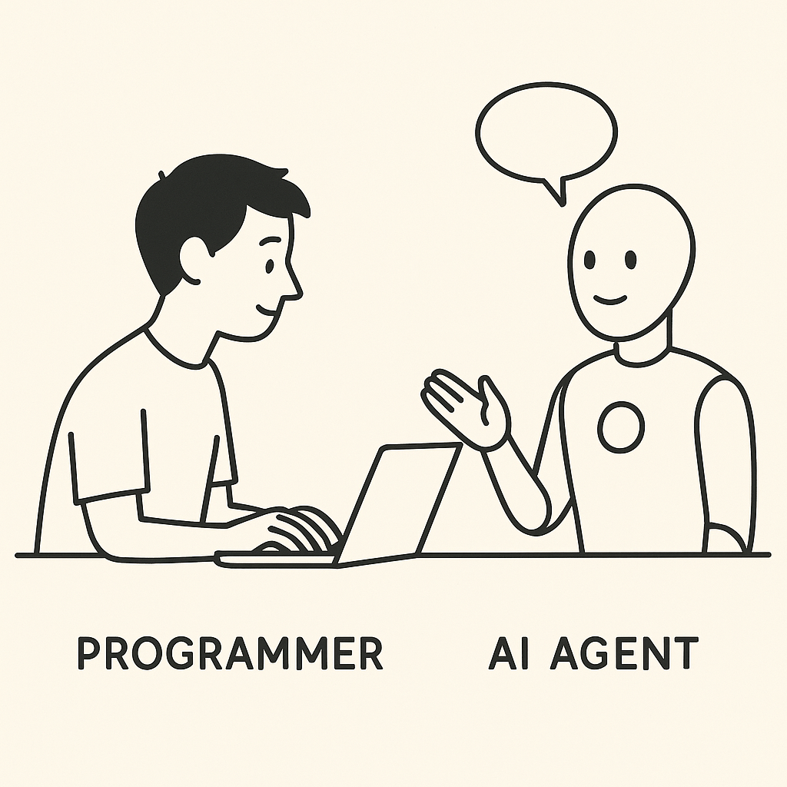

# Build Small Defined Tasks


 
>  Now that you have a AI-friendly description of the codebase, it's time to break down the tasks into smaller, manageable pieces. This will help you and your team work more efficiently and effectively. Here are some steps to follow:

## Characteristics of a Good Task

- **Small**: The task should be small enough to be completed in a short amount of time (e.g., a few hours to a day).
- **Well-defined**: The task should have a clear goal and outcome. It should be easy to understand what needs to be done and how to do it.
- **Testable**: The task should be easy to test and verify once it's completed. This will help ensure that the code is working as expected and that any bugs are caught early.

## Creating a Task using AI Agents

When creating a task, you can use an AI agent to help you break down the task into smaller, manageable pieces. The AI agent can also help you create a detailed plan for completing the task.
 
You should start a prompt with the following:
```prompt
I would like to define a task. This task should be small, well-defined, and 
testable. The task is as follows:
<task description>
If my task is not small, well-defined, and testable, please let me know how to 
break it down into smaller tasks.
Otherwise, please provide a detailed plan for completing the task and save it as 
a markdown file in the `tasks` folder.  
The file name should be `task_<number>_<task_name>.md`.
```
 

 ## Editing the Task

Once the AI agent has created the task, you can review and edit it as needed. Make sure to check for any errors or inconsistencies in the task description and plan. You can also add any additional information or context that may be helpful for the developer who will be working on the task.

### Adding Additional Information
You can use the following prompt to edit the task:
```prompt
This task is written well, but I would like to add some additional information. 
Please add the following information to the task:
<additional information>
```
### Changing the Task Description
You can use the following prompt to change the task description:
```prompt
This task is written well, but I would like to change the task description. 
Please change the task description to:
<change task description/ additional information>
```

### (For TDD)Adding a Test Plan
You can use the following prompt to add a test plan:
```prompt
This task is written well, but I would like to add a test plan. 
Please add the following test plan to the task:
<test plan>
```

You can also add examples of how to test the task. For example:
`view the following test cases and add them to the task`.